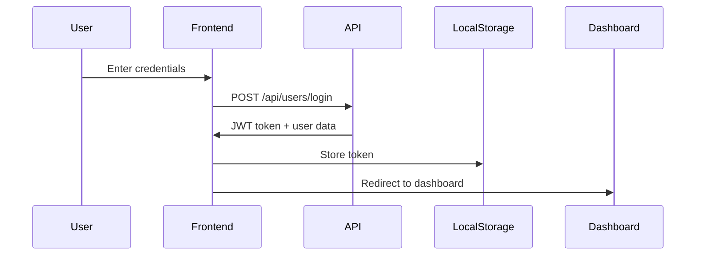

# Frontend Development Guide

Complete guide for developing and maintaining the frontend of the Swedish Learning Application.

## 📋 Table of Contents

- [Architecture Overview](#architecture-overview)
- [File Structure](#file-structure)
- [Core Components](#core-components)
- [Authentication Flow](#authentication-flow)
- [API Integration](#api-integration)
- [UI Components](#ui-components)
- [State Management](#state-management)
- [Testing Guide](#testing-guide)
- [Development Workflow](#development-workflow)

## 🏗️ Architecture Overview

The frontend is built with **vanilla JavaScript**, **HTML5**, and **CSS3** following a modular component-based architecture. No frameworks are used to keep the application lightweight and educational.

### Technology Stack
- **JavaScript**: ES6+ vanilla JavaScript
- **HTML**: Semantic HTML5
- **CSS**: CSS3 with CSS Grid and Flexbox
- **Authentication**: JWT tokens with localStorage
- **API Communication**: Fetch API
- **Build Process**: No build step required
- **Testing**: Jest for unit tests

### Design Principles
- **Progressive Enhancement**: Core functionality works without JavaScript
- **Responsive Design**: Mobile-first approach
- **Accessibility**: WCAG 2.1 AA compliance
- **Performance**: Minimal dependencies, efficient code
- **Modularity**: Reusable components and utilities

---

## 📁 File Structure

```
frontend/
├── css/                         # Stylesheets
│   ├── main.css                # Global styles and variables
│   ├── components.css          # Reusable component styles
│   ├── pages.css               # Page-specific styles
│   ├── responsive.css          # Media queries
│   └── themes.css              # Color themes and variants
├── js/                         # JavaScript modules
│   ├── auth.js                 # Authentication logic
│   ├── dashboard.js            # Dashboard functionality
│   ├── flashcards.js           # Flashcard game logic
│   ├── grammar.js              # Grammar lesson interface
│   ├── main.js                 # Application entry point
│   ├── modal.js                # Modal component system
│   ├── nav.js                  # Navigation handling
│   ├── progress.js             # Progress visualization
│   ├── quiz.js                 # Quiz/test interface
│   ├── review-mistakes.js      # Mistake review system
│   ├── utility.js              # Utility functions
│   └── words.js                # Word management interface
├── assets/                     # Static assets
│   ├── images/                 # Images and icons
│   ├── fonts/                  # Custom fonts
│   └── audio/                  # Audio files (pronunciation)
├── tests/                      # Frontend tests
│   ├── components/             # Component tests
│   ├── integration/            # Integration tests
│   └── utils/                  # Utility function tests
├── index.html                  # Landing page
├── dashboard.html              # Main dashboard
├── flashcards.html             # Flashcard interface
├── grammar.html                # Grammar lessons
├── words.html                  # Word management
├── quiz.html                   # Quiz interface
├── review-mistakes.html        # Mistake review
└── modal-demo.html             # Component demonstrations
```

---

## 🧩 Core Components

### 1. Authentication System (`auth.js`)

Handles user registration, login, and session management.

```javascript
// Key Functions
class Auth {
    static async login(email, password) {
        // Login user and store JWT token
    }
    
    static async register(userData) {
        // Register new user account
    }
    
    static logout() {
        // Clear session and redirect
    }
    
    static isAuthenticated() {
        // Check if user has valid token
    }
    
    static getAuthHeader() {
        // Get authorization header for API calls
    }
}
```

**Features**:
- JWT token management with localStorage
- Automatic token expiration handling
- Form validation with real-time feedback
- Password strength indicator
- Remember me functionality

### 2. Navigation System (`nav.js`)

Manages application navigation and menu states.

```javascript
// Key Functions
class Navigation {
    static init() {
        // Initialize navigation system
    }
    
    static updateActiveState(currentPage) {
        // Update active menu item
    }
    
    static toggleMobileMenu() {
        // Toggle mobile hamburger menu
    }
    
    static showUserMenu(userData) {
        // Display user profile menu
    }
}
```

### 3. Modal System (`modal.js`)

Reusable modal component for dialogs and overlays.

```javascript
// Key Functions
class Modal {
    static show(options) {
        // Display modal with content
    }
    
    static hide(modalId) {
        // Hide specific modal
    }
    
    static confirm(message, callback) {
        // Show confirmation dialog
    }
    
    static alert(message, type) {
        // Show alert notification
    }
}
```

---

## 🔐 Authentication Flow

### 1. Login Process


### 2. Token Management
```javascript
// Token storage and retrieval
const TokenManager = {
    store(token) {
        localStorage.setItem('authToken', token);
    },
    
    get() {
        return localStorage.getItem('authToken');
    },
    
    clear() {
        localStorage.removeItem('authToken');
    },
    
    isExpired(token) {
        const payload = JSON.parse(atob(token.split('.')[1]));
        return payload.exp * 1000 < Date.now();
    }
};
```

### 3. Protected Route Guard
```javascript
// Route protection
function requireAuth() {
    if (!Auth.isAuthenticated()) {
        window.location.href = '/index.html';
        return false;
    }
    return true;
}

// Use in each protected page
if (!requireAuth()) {
    // Page will redirect to login
}
```

---

## 🌐 API Integration

### 1. HTTP Client (`utility.js`)
```javascript
const ApiClient = {
    baseURL: 'http://localhost:3000/api',
    
    async request(endpoint, options = {}) {
        const url = `${this.baseURL}${endpoint}`;
        const config = {
            headers: {
                'Content-Type': 'application/json',
                ...Auth.getAuthHeader(),
                ...options.headers
            },
            ...options
        };
        
        try {
            const response = await fetch(url, config);
            const data = await response.json();
            
            if (!response.ok) {
                throw new ApiError(data.error, response.status);
            }
            
            return data;
        } catch (error) {
            console.error('API Error:', error);
            throw error;
        }
    },
    
    get(endpoint, params) {
        const query = params ? '?' + new URLSearchParams(params) : '';
        return this.request(endpoint + query);
    },
    
    post(endpoint, data) {
        return this.request(endpoint, {
            method: 'POST',
            body: JSON.stringify(data)
        });
    },
    
    put(endpoint, data) {
        return this.request(endpoint, {
            method: 'PUT', 
            body: JSON.stringify(data)
        });
    },
    
    delete(endpoint) {
        return this.request(endpoint, {
            method: 'DELETE'
        });
    }
};
```

### 2. Error Handling
```javascript
class ApiError extends Error {
    constructor(errorData, status) {
        super(errorData.message);
        this.name = 'ApiError';
        this.code = errorData.code;
        this.status = status;
        this.details = errorData.details;
    }
}

// Global error handler
window.addEventListener('unhandledrejection', (event) => {
    if (event.reason instanceof ApiError) {
        if (event.reason.status === 401) {
            Auth.logout(); // Redirect to login
        } else {
            Modal.alert(event.reason.message, 'error');
        }
        event.preventDefault();
    }
});
```

---

## 🎯 UI Components

### 1. Flashcard Component (`flashcards.js`)

Interactive flashcard system with spaced repetition.

```javascript
class FlashcardGame {
    constructor(container) {
        this.container = container;
        this.words = [];
        this.currentIndex = 0;
        this.session = {
            correct: 0,
            total: 0,
            learnedWords: [],
            shownWords: []
        };
    }
    
    async loadWords(limit = 10) {
        const response = await ApiClient.get('/learning/flashcards', { limit });
        this.words = response.data;
        this.renderCard();
    }
    
    renderCard() {
        const word = this.words[this.currentIndex];
        this.container.innerHTML = `
            <div class="flashcard" id="flashcard">
                <div class="flashcard-inner">
                    <div class="flashcard-front">
                        <h2>${word.swedish}</h2>
                        <p class="word-type">${word.type}</p>
                    </div>
                    <div class="flashcard-back">
                        <h2>${word.english}</h2>
                        <div class="difficulty">
                            Level ${word.difficultyLevel}
                        </div>
                    </div>
                </div>
                <div class="flashcard-controls">
                    <button onclick="game.flipCard()">Flip</button>
                    <button onclick="game.markCorrect()" class="correct">✓ Correct</button>
                    <button onclick="game.markIncorrect()" class="incorrect">✗ Incorrect</button>
                </div>
            </div>
        `;
    }
    
    flipCard() {
        document.getElementById('flashcard').classList.toggle('flipped');
    }
    
    markCorrect() {
        this.session.correct++;
        this.session.learnedWords.push(this.getCurrentWord().swedish);
        this.nextCard();
    }
    
    markIncorrect() {
        // Add to review list but don't mark as learned
        this.nextCard();  
    }
    
    async nextCard() {
        this.session.total++;
        this.session.shownWords.push(this.getCurrentWord().swedish);
        
        if (this.currentIndex < this.words.length - 1) {
            this.currentIndex++;
            this.renderCard();
        } else {
            await this.endSession();
        }
    }
    
    async endSession() {
        const progress = await ApiClient.post('/progress/flashcards', {
            learnedWords: this.session.learnedWords,
            shownWords: this.session.shownWords,
            sessionStats: {
                accuracy: (this.session.correct / this.session.total) * 100,
                duration: this.getSessionDuration()
            }
        });
        
        this.showResults(progress.data);
    }
}
```

### 2. Progress Visualization (`progress.js`)

Charts and statistics for learning progress.

```javascript
class ProgressChart {
    constructor(canvas, type = 'line') {
        this.canvas = canvas;
        this.ctx = canvas.getContext('2d');
        this.type = type;
    }
    
    render(data) {
        switch (this.type) {
            case 'line':
                this.renderLineChart(data);
                break;
            case 'bar':
                this.renderBarChart(data);
                break;
            case 'pie':
                this.renderPieChart(data);
                break;
        }
    }
    
    renderLineChart(data) {
        // Custom chart implementation
        // (Could also integrate Chart.js if needed)
        const { width, height } = this.canvas;
        this.ctx.clearRect(0, 0, width, height);
        
        // Draw axes, grid, and data points
        this.drawAxes();
        this.drawDataPoints(data);
        this.drawConnectingLines(data);
    }
}

// Usage
const progressChart = new ProgressChart(document.getElementById('progress-chart'));
progressChart.render(userStats.recentActivity);
```

### 3. Word Management Interface (`words.js`)

CRUD interface for vocabulary management.

```javascript
class WordManager {
    constructor() {
        this.words = [];
        this.currentFilter = 'all';
        this.sortField = 'swedish';
        this.sortOrder = 'asc';
    }
    
    async loadWords(filters = {}) {
        const response = await ApiClient.get('/words', filters);
        this.words = response.data;
        this.renderWordList();
    }
    
    renderWordList() {
        const container = document.getElementById('words-container');
        container.innerHTML = this.words.map(word => `
            <div class="word-card" data-id="${word.id}">
                <div class="word-main">
                    <h3>${word.swedish}</h3>
                    <p>${word.english}</p>
                </div>
                <div class="word-meta">
                    <span class="word-type">${word.type}</span>
                    <span class="difficulty">Level ${word.difficultyLevel}</span>
                </div>
                <div class="word-actions">
                    <button onclick="wordManager.editWord(${word.id})">Edit</button>
                    <button onclick="wordManager.deleteWord(${word.id})">Delete</button>
                </div>
            </div>
        `).join('');
    }
    
    async addWord(wordData) {
        const response = await ApiClient.post('/words', wordData);
        this.words.push(response.data);
        this.renderWordList();
        Modal.alert('Word added successfully!', 'success');
    }
    
    showAddWordModal() {
        Modal.show({
            title: 'Add New Word',
            content: `
                <form id="add-word-form">
                    <input type="text" name="swedish" placeholder="Swedish word" required>
                    <input type="text" name="english" placeholder="English translation" required>
                    <select name="type" required>
                        <option value="">Select word type</option>
                        <option value="noun">Noun</option>
                        <option value="verb">Verb</option>
                        <option value="adjective">Adjective</option>
                        <!-- ... other options -->
                    </select>
                    <select name="difficultyLevel">
                        <option value="1">Level 1 (Beginner)</option>
                        <option value="2">Level 2</option>
                        <option value="3">Level 3</option>
                        <option value="4">Level 4</option>
                        <option value="5">Level 5 (Advanced)</option>
                    </select>
                    <button type="submit">Add Word</button>
                </form>
            `,
            onShow: () => {
                document.getElementById('add-word-form').addEventListener('submit', (e) => {
                    e.preventDefault();
                    const formData = new FormData(e.target);
                    this.addWord(Object.fromEntries(formData));
                    Modal.hide();
                });
            }
        });
    }
}
```

---

## 📊 State Management

### 1. Application State
```javascript
// Global application state
const AppState = {
    user: null,
    isAuthenticated: false,
    currentPage: 'dashboard',
    theme: 'light',
    language: 'en',
    
    // State management methods
    setState(newState) {
        Object.assign(this, newState);
        this.notifySubscribers();
    },
    
    subscribers: [],
    
    subscribe(callback) {
        this.subscribers.push(callback);
    },
    
    notifySubscribers() {
        this.subscribers.forEach(callback => callback(this));
    }
};
```

### 2. Local Storage Management
```javascript
const StorageManager = {
    keys: {
        AUTH_TOKEN: 'authToken',
        USER_DATA: 'userData',
        THEME: 'theme',
        LANGUAGE: 'language'
    },
    
    get(key, defaultValue = null) {
        try {
            const value = localStorage.getItem(key);
            return value ? JSON.parse(value) : defaultValue;
        } catch {
            return defaultValue;
        }
    },
    
    set(key, value) {
        localStorage.setItem(key, JSON.stringify(value));
    },
    
    remove(key) {
        localStorage.removeItem(key);
    },
    
    clear() {
        localStorage.clear();
    }
};
```

---

## 🧪 Testing Guide

### 1. Unit Tests Structure
```javascript
// tests/components/flashcards.test.js
describe('FlashcardGame', () => {
    let game;
    let mockContainer;
    
    beforeEach(() => {
        mockContainer = document.createElement('div');
        game = new FlashcardGame(mockContainer);
    });
    
    test('should initialize with empty words array', () => {
        expect(game.words).toEqual([]);
        expect(game.currentIndex).toBe(0);
    });
    
    test('should load words from API', async () => {
        const mockWords = [
            { swedish: 'hus', english: 'house', type: 'noun' }
        ];
        
        // Mock API response
        ApiClient.get = jest.fn().mockResolvedValue({ data: mockWords });
        
        await game.loadWords();
        
        expect(game.words).toEqual(mockWords);
        expect(ApiClient.get).toHaveBeenCalledWith('/learning/flashcards', { limit: 10 });
    });
});
```

### 2. Integration Tests
```javascript
// tests/integration/auth-flow.test.js
describe('Authentication Flow', () => {
    test('should login and redirect to dashboard', async () => {
        // Mock successful login response
        global.fetch = jest.fn().mockResolvedValue({
            ok: true,
            json: () => Promise.resolve({
                data: {
                    user: { id: 1, email: 'test@example.com' },
                    token: 'mock-jwt-token'
                }
            })
        });
        
        await Auth.login('test@example.com', 'password123');
        
        expect(localStorage.getItem('authToken')).toBe('mock-jwt-token');
        expect(window.location.href).toContain('dashboard.html');
    });
});
```

### 3. E2E Test Guidelines
```javascript
// Using Playwright or Cypress
describe('Complete Learning Session', () => {
    test('user can complete a flashcard session', async () => {
        // 1. Login
        await page.goto('/index.html');
        await page.fill('[name="email"]', 'test@example.com');
        await page.fill('[name="password"]', 'password123');
        await page.click('button[type="submit"]');
        
        // 2. Start flashcard session
        await page.click('text=Start Learning');
        await expect(page.locator('.flashcard')).toBeVisible();
        
        // 3. Complete session
        for (let i = 0; i < 5; i++) {
            await page.click('text=Flip');
            await page.click('text=Correct');
        }
        
        // 4. Verify results
        await expect(page.locator('.session-results')).toBeVisible();
        await expect(page.locator('.accuracy')).toContainText('100%');
    });
});
```

---

## 🔧 Development Workflow

### 1. Local Development Setup
```bash
# No build process required
# Simply serve files with a local server

# Using Python
python -m http.server 8000

# Using Node.js
npx serve .

# Using VS Code Live Server extension
# Right-click index.html -> "Open with Live Server"
```

### 2. Code Organization Guidelines

**File Naming Convention**:
- Use kebab-case for HTML files: `review-mistakes.html`
- Use camelCase for JavaScript files: `flashcards.js`
- Use kebab-case for CSS files: `components.css`

**JavaScript Module Pattern**:
```javascript
// Each JS file should follow this pattern
(function() {
    'use strict';
    
    // Private variables and functions
    let privateVar = 'hidden';
    
    function privateFunction() {
        // Internal logic
    }
    
    // Public API
    window.ModuleName = {
        init() {
            // Module initialization
        },
        
        publicMethod() {
            // Public functionality
        }
    };
    
    // Auto-initialize if DOM is ready
    if (document.readyState === 'loading') {
        document.addEventListener('DOMContentLoaded', window.ModuleName.init);
    } else {
        window.ModuleName.init();
    }
})();
```

### 3. Performance Best Practices

**Lazy Loading**:
```javascript
// Load components only when needed
async function loadComponent(name) {
    if (!window[name]) {
        await import(`./js/${name.toLowerCase()}.js`);
    }
    return window[name];
}

// Usage
const flashcards = await loadComponent('FlashcardGame');
```

**Image Optimization**:
```html
<!-- Use responsive images -->

```

**CSS Performance**:
```css
/* Use CSS custom properties for theming */
:root {
    --primary-color: #006aa7;
    --secondary-color: #fecc00;
    --text-color: #333;
    --bg-color: #fff;
}

/* Efficient animations */
.flashcard-flip {
    transform: rotateY(180deg);
    transition: transform 0.3s ease-in-out;
    will-change: transform;
}
```

### 4. Accessibility Guidelines

**Semantic HTML**:
```html
<main role="main">
    <section aria-labelledby="flashcards-heading">
        <h2 id="flashcards-heading">Vocabulary Practice</h2>
        <div class="flashcard" role="button" tabindex="0" 
             aria-label="Swedish word: hus">
            <!-- Flashcard content -->
        </div>
    </section>
</main>
```

**Keyboard Navigation**:
```javascript
// Ensure all interactive elements are keyboard accessible
document.addEventListener('keydown', (e) => {
    if (e.key === 'Enter' || e.key === ' ') {
        if (e.target.classList.contains('flashcard')) {
            e.preventDefault();
            flipCard();
        }
    }
});
```

**ARIA Labels and Live Regions**:
```html
<!-- Live region for dynamic updates -->
<div id="status" aria-live="polite" aria-atomic="true"></div>

<!-- Progress indicator -->
<div role="progressbar" aria-valuenow="3" aria-valuemin="0" 
     aria-valuemax="10" aria-label="Question 3 of 10">
    <div class="progress-fill" style="width: 30%"></div>
</div>
```

---

This frontend guide provides a comprehensive overview of the application's client-side architecture, components, and development practices. Follow these patterns and guidelines to maintain code quality and consistency across the application.